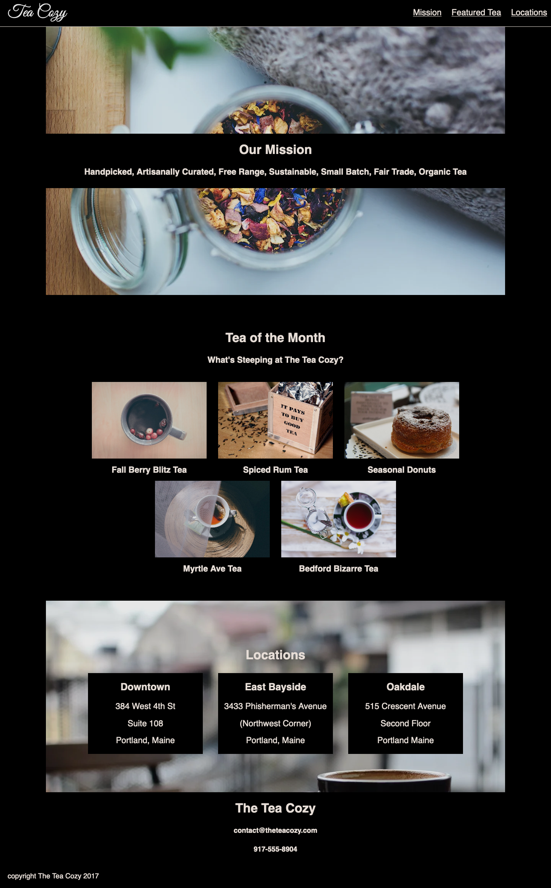

# CodeCademy Project: Tea Cozy

This is my solution to the Tea Cozy challenge in CodeCademy's Learn Intermediate CSS Course.

## Table of contents

- [Overview](#overview)
  - [The challenge](#the-challenge)
  - [Screenshot](#screenshot)
  - [Links](#links)
- [My process](#my-process)
  - [What I learned](#what-i-learned)
  - [Continued development](#continued-development)
  - [Useful resources](#useful-resources)

## Overview

### The challenge

"Project Goals

In this project, you will create a fictional tea shop website on your own computer.

We will provide a design spec and image assets to help you along the way. A design spec is an image of a web page outlined with all of its CSS properties and values. These are usually created by a designer as a source of instructions for a web developer. This project assumes that you will be able to reproduce the basic HTML and CSS with little guidance. "

-CodeCademy

### Screenshot

Design Spec:

My Solution: 

### Links

- Live Site URL: [Tea Cozy]()

## My process

### What I learned

I found this very educational as the design spec is incorrectly labelled. I was really scratching my head using different flex layouts to try and get the dimensions and look to match, only to realise after an hour or so that they were wrong. In the end I chose to use the labelled dimensions and try and get things looking as close as possible. 

I also learned how to use anchor links to jump to different sections on the page.

### Continued development

I need more practice with flex but I feel more comfortable now and was able to build this page quite quickly. 

### Useful resources

- [How to Create a Link to Jump to a Specific Part of a Page](https://blog.hubspot.com/marketing/jump-link-same-page) - Used for jump links.
- [A Complete Guide to Flexbox](https://css-tricks.com/snippets/css/a-guide-to-flexbox/) - Helped massively with my flex experimentation. 
- [Mastering Wrapping of Flex Items](https://developer.mozilla.org/en-US/docs/Web/CSS/CSS_Flexible_Box_Layout/Mastering_Wrapping_of_Flex_Items) - Helped me figure out some things about spacing and margins.